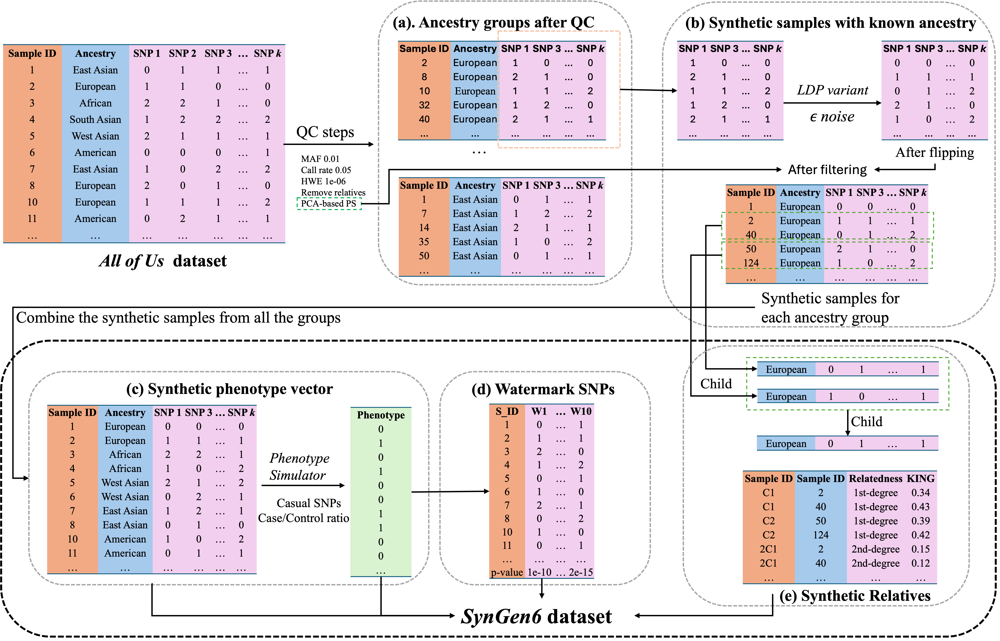

# SynGen6

[](https://opensource.org/licenses/MIT)

This repo contains the scripts and codes for 

*Synthetic Genomic Dataset with Diverse Ancestry} (SynGen6)*

from Rutgers Institution for Data Science, Learning and Applications ([iDSLA, Rutgers University](https://sites.rutgers.edu/idsla/))

## Overview

This repository contains the code for generating synthetic genomic dataset with diverse ancestry. The general overview of the steps are shown in the following figure:


## Syntheic Data Generation Scripts

In this project, we provide two scripts for generating synthetic genomic dataset with diverse ancestry, both of them are jupyter notebook, please run them in jupyter notebook.

### Scripts for Synthetic Data Generation based on Human 1000 Genomes dataset

#### Environment Setup

`gen_human1000.ipynb` is for generating synthetic genomic dataset of human 1000 Genomes dataset, you need to first setup the environment with following commands:
```shell
pip install virtualenv
python -m venv env
source env/Scripts/activate
pip install -r requirements.txt
```
#### Details of Synthetic Data Generation Flow
The generation code of Synthetic Data based on Human 1000 Genomes dataset are in `gen_human1000.ipynb` and `gen_pheno.R`. You just need to run the jupyter notebook and R script following the instruction in the notebook. The detailed steps are as follows:

1. **Real Data Loading and Quality Control (see `gen_human1000.ipynb`)**

    **Input Files:**
      - `all_hg38.bed`, `all_hg38.bim`, `all_hg38.fam`: The original Human 1000 Genomes dataset in PLINK format. Noted, it has to be read only from plink tools. `plink.exe` is the executable file for plink tools, you can download it from [here](https://www.cog-genomics.org/plink/2.0/) for linux and macOS.

    **Output Files:**
      - `genotype_data_qc.log` shows the logging of quality control of plink tools.
      - `genotype_data_qc.raw`: real data with CSV format after quanlity control, so that it can be loaded by using pandas.

2. **Synthetic SNPs Generation (see `gen_human1000.ipynb`)**

    **Input Files:** `genotype_data_qc.raw`: real data with CSV format after quanlity control.
    
    **Output Files:** `all_hg38_snp.csv`: synthetic SNPs data with CSV format (see Generated Data Documentation below for structure of this file).

3. **Synthetic Phenotype Generation (see `gen_pheno.R`)**

    **Input Files:** `all_hg38_snp.csv`: synthetic SNPs data with CSV format.
    
    **Output Files:** `all_hg38_phenotype.csv`: synthetic phenotype data with CSV format (see Generated Data Documentation below for structure of this file).

4. **Watermark SNP Generation (see `gen_human1000.ipynb`)**

    **Input Files:** `all_hg38_phenotype.csv`: synthetic phenotype data.
    
    **Output Files:** `all_hg38_watermark_snp.csv`: synthetic watermark SNPs data with CSV format (see Generated Data Documentation below for structure of this file).

5. **Synthetic Relatives Generation (see `gen_human1000.ipynb`)**

    **Input Files:** `all_hg38_snp.csv`: synthetic SNPs data.
    
    **Output Files:** `all_hg38_relative_snps.csv`: synthetic relatives data with CSV format (see Generated Data Documentation below for structure of this file).

 
### Scripts for Synthetic Data Generation based on AllofUs dataset

`gen_allofus.ipynb` is for generating synthetic genomic dataset of AllofUs dataset.

Noted that `gen_allofus.ipynb` needs to be run inside AllofUS Research Workbench, which can be accessed at https://workbench.researchallofus.org/ with data access of Controlled Tier dataset.

#### Details of Synthetic Data Generation Flow

The generation code of Synthetic Data based on AllofUs dataset are in `gen_allofus.ipynb`. You just need to run the jupyter notebook following the instruction in the notebook. The detailed steps are as follows:

1. Load data and Plink Quality Control
2. Generate Synthetic SNPs
3. Generate Synthetic Phenotype
4. Generate Watermark SNPs
5. Generate Synthetic Relatives
6. Generate Synthetic Relatives SNPs
5. Analysis and Verification

## Generated Data Documentation

After running the generation script, you can find the generated data including:

- **Sample SNP Data (`XX_snp.csv`)**: This file contains the SNP data for all individuals in the dataset. Each row corresponds to a unique individual.
  - **Column 1**: Sample ID. A unique identifier for each individual.
  - **Column 2**: Ancestry. The ancestry group (e.g., African, European, etc.).
  - **Columns 3 onward**: Each column represents a specific SNP, with values reflecting the genotype (e.g., 0, 1, or 2).specific SNP, with values reflecting the genotype(e.g., 0, 1, or 2).

- **Phenotype Condition Data (`XX_phenotype.csv`)**: This file contains phenotype information for each individual.
  - **Column 1**: Sample ID. Unique identifier for each individual.
  - **Column 2**: Phenotype Condition. A binary variable representing the presence (1) or absence (0) of the simulated condition.

- **Watermark SNP Data (`XX_watermarksnp.csv`)**: This file includes the synthetic watermark SNPs designed to ensure data integrity.
  - **Columns 1-20**: Watermark SNPs ID. Synthetic SNPs used for validation purposes.
  - **Row 1-30000**: Sample ID. Each row represents the SNPs values for each sample.
  - **Row 30001**: p-values. The p-values indicates the statistical association between each watermark SNP and the phenotype condition.

- **Kinship-Relatedness Data (`XX_kinship_relatedness.csv`)**: This file provides information on the synthetic relatives in the dataset.
  - **Column 1**: Sample ID - The ID of the synthetic individual related to a sample in the Sample SNP Data file.
  - **Column 2**: Ancestor ID - The Sample ID from the Sample SNP Data to which the synthetic individual is related.
  - **Column 3**: Relatedness - Presents the kinship re-
lationship.
  - **Column 4**: Kinship Coefficient - Provides the cal-
culated kinship coefficients between the SNP data
of the synthetic individual and its ancestor.

- **Synthetic Relatives SNP data (`XX_relative_snps.csv`)**: This file provides SNP information on the synthetic relatives in the dataset.
  - **Column 1**: Sample ID. A unique identifier for each individual.
  - **Columns 2 onward**: Each column represents a specific SNP, with values reflecting the genotype (e.g., 0, 1, or 2)

